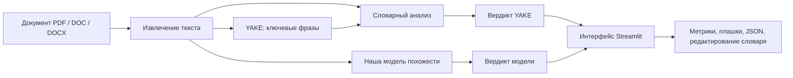
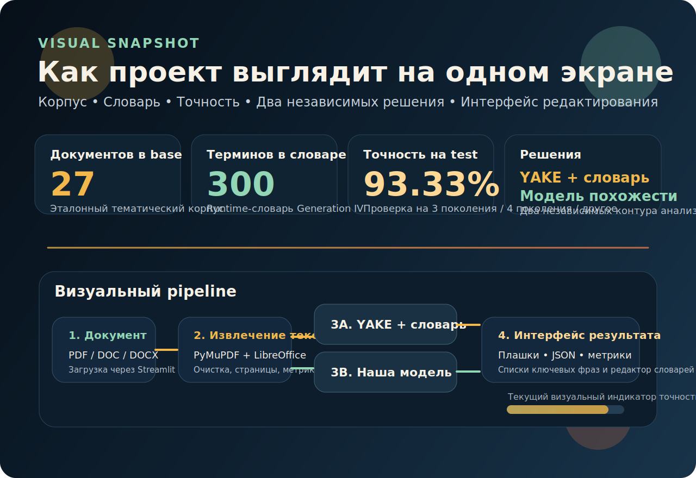

# Бот извлекатель

<p align="center">
  
</p>

<p align="center">
  
  
  
  
</p>

<p align="center">
  <b>Интерактивный дипломный прототип для извлечения текста, поиска ключевых фраз и тематического анализа материалов по реакторам IV поколения.</b>
</p>

---

## Почему этот проект интересный

Это не просто загрузчик PDF.

Проект делает сразу несколько вещей:

- принимает `PDF`, `DOC`, `DOCX`;
- извлекает текст через `PyMuPDF` и `LibreOffice`;
- выделяет ключевые фразы через `YAKE`;
- строит словарь терминов по корпусу `base`;
- анализирует новые документы двумя независимыми способами;
- показывает вероятность, вердикт, совпадения и ключевые признаки;
- позволяет вручную редактировать словарь `YAKE` и словарь модели прямо из интерфейса.

---

## Как это выглядит логически



---

## Визуальный блок

<p align="center">
  
</p>

<p align="center">
  <b>Ниже собран визуальный snapshot проекта:</b> размер корпуса, активный словарь, точность проверки и два независимых контура принятия решения.
</p>

### Что показывает этот блок

- сколько документов сейчас находится в `base`;
- сколько терминов живет в runtime-словаре;
- какая точность сейчас получается на корпусе `test`;
- как параллельно работают `YAKE` и наша модель;
- какие пользовательские действия поддерживает интерфейс.

---

## Что именно делает система

### 1. Извлечение текста

- `PDF` разбираются через `PyMuPDF`
- `DOC` / `DOCX` переводятся в текст через `LibreOffice`
- текст очищается от мусора, лишних пробелов и артефактов конвертации

### 2. Извлечение ключевых фраз

После получения текста включается `YAKE`.

`YAKE`:

- работает без размеченного корпуса;
- ищет статистически характерные фразы внутри конкретного документа;
- выдает список фраз и их `score`;
- чем меньше `score`, тем сильнее фраза для данного текста.

### 3. Два независимых решения по теме

После извлечения текста документ проходит через два отдельных контура:

#### Решение 1. YAKE + словарь

Система:

- берет фразы из `YAKE`;
- сравнивает их со словарем по `Generation IV`;
- считает покрытие словарем;
- считает confidence;
- выдает вердикт `gen4 / other`.

#### Решение 2. Наша модель

Наша модель:

- берет словарь, собранный по корпусу `base`;
- строит вектор похожести документа на эталонный корпус;
- считает `similarity`;
- сравнивает его с порогом;
- выдает вердикт `gen4 / other`.

Именно поэтому в интерфейсе показываются две отдельные плашки:

- `Решение модели`
- `Решение YAKE`

---

## Как работает наша модель

<details>
<summary><b>Открыть подробное объяснение модели</b></summary>

### Идея

В этом проекте модель не обучается как классический тяжелый классификатор на тысячах примеров.

Вместо этого она работает как **модель похожести на эталонный корпус**.

Эталонный корпус лежит в папке `base/` и состоит из документов по тематике `Generation IV`.

### Шаги

#### Шаг 1. Строим активный словарь

Из корпуса `base` собирается runtime-словарь:

- берутся названия файлов;
- берутся ключевые фразы `YAKE`;
- фильтруются шумовые и слишком общие термины;
- сохраняются наиболее полезные термины.

#### Шаг 2. Представляем каждый документ как вектор терминов

Если в тексте встречаются словарные термины, документ получает вектор весов:

```text
документ -> набор найденных терминов -> взвешенный вектор
```

#### Шаг 3. Строим центр эталонного корпуса

Для корпуса `base` считается усредненный вектор:

```text
centroid = average(v_1, v_2, ..., v_n)
```

Это и есть “средний профиль” документа по IV поколению.

#### Шаг 4. Считаем похожесть нового документа

Для нового документа считается косинусная близость:

```text
similarity = cosine(document_vector, centroid)
```

Если `similarity` выше порога, модель говорит:

```text
gen4
```

Иначе:

```text
other
```

### Формально

Косинусная близость:

```math
\mathrm{cosine}(x, y) = \frac{x \cdot y}{\|x\|\|y\|}
```

Вероятность в интерфейсе строится из `similarity` через сглаживание:

```math
P(gen4) = \sigma\left(\frac{similarity - threshold}{scale}\right)
```

где:

- `threshold` — выбранный порог модели;
- `scale` — коэффициент чувствительности;
- `σ` — сигмоида.

### Почему это хорошо для диплома

- модель объяснима;
- видно, какие термины повлияли на решение;
- легко перестраивается при изменении словаря;
- хорошо подходит для предметной области с устойчивой терминологией.

</details>

---

## Как работает решение на YAKE

<details>
<summary><b>Открыть подробное объяснение YAKE-контура</b></summary>

### Идея

`YAKE` не классифицирует документ напрямую.

Он сначала выделяет ключевые фразы, а уже потом система сравнивает их со словарем `Generation IV`.

### Схема

```text
Документ
 -> YAKE
 -> список ключевых фраз
 -> сравнение со словарем
 -> confidence
 -> вердикт gen4 / other
```

### Что использует YAKE

`YAKE` оценивает фразы по локальным признакам:

- частота;
- позиция в тексте;
- распределение по предложениям;
- регистр;
- связи с соседними словами.

Принцип простой:

- более характерные фразы получают меньший `score`;
- затем они сравниваются с доменным словарем.

### Что происходит дальше

Если:

- фраза похожа на термин словаря;
- терминов найдено достаточно;
- итоговый confidence выше порога `YAKE`,

то `YAKE`-контур выдает `gen4`.

Иначе выдает `other`.

</details>

---

## Почему две системы лучше одной

Потому что они дополняют друг друга.

### YAKE лучше, когда:

- в документе есть яркие тематические термины;
- нужно быстро показать совпадения словаря;
- нужна прозрачная интерпретация через ключевые слова.

### Наша модель лучше, когда:

- документ написан иначе, чем термины словаря;
- тематичность выражена более “распределенно”;
- нужно оценить похожесть на весь корпус, а не только на отдельные фразы.

### Вместе они дают:

- более устойчивую оценку;
- более понятный интерфейс для пользователя;
- удобный инструмент для дипломной демонстрации.

---

## Корпус и словари

### Эталонный корпус

Папка:

```text
base/
```

Используется как основной тематический корпус по `Generation IV`.

### Проверочный корпус

Папка:

```text
test/
```

Используется для проверки, как система разделяет:

- `4 поколение`
- `3 поколение`
- `другое`

### Runtime-файлы

- `data/base_document_cache.json` — кэш извлеченного текста
- `data/runtime_training_corpus.json` — активный runtime-корпус
- `data/runtime_dictionary.json` — активный runtime-словарь
- `data/manual_dictionary_overrides.json` — ручные правки словарей

---

## Редактирование словаря вручную

Внизу интерфейса есть два отдельных блока:

- `Редактировать словарь модели`
- `Редактировать словарь YAKE`

Через них можно:

- добавить свои термины;
- добавить варианты написания;
- задать вес термина;
- исключить ненужные термины из словаря;
- отдельно управлять словарем модели и словарем `YAKE`.

Это важно, потому что:

- `YAKE` и модель теперь можно настраивать независимо;
- ручные правки не пропадают при пересборке корпуса;
- система становится удобной для экспериментальной работы в дипломе.

---

## Что пользователь видит в интерфейсе

После загрузки документа пользователь получает:

- текст документа;
- список ключевых фраз;
- раскрывающийся список всех отобранных фраз;
- решение модели;
- решение `YAKE`;
- вероятности;
- similarity;
- покрытие словарем;
- скрытый технический блок с порогами и совпадениями;
- JSON-результат для скачивания.

---

## Быстрый старт

```bash
cd /home/user/bot_extract
chmod +x run.sh
./run.sh
```

Если нужно указать свой порт:

```bash
cd /home/user/bot_extract
PORT=8502 ./run.sh
```

---

## Ручной запуск

```bash
cd /home/user/bot_extract
conda run -n bot_env streamlit run app.py --server.address 0.0.0.0 --server.port 8502
```

---

## Зависимости

Если нужно переустановить зависимости:

```bash
source /home/user/conda/etc/profile.d/conda.sh
conda activate bot_env
pip install -r requirements.txt
```

---

## Технологии

- `Streamlit`
- `PyMuPDF`
- `YAKE`
- `pandas`
- `numpy`
- `LibreOffice`

---

## Структура проекта

```text
bot_extract/
├── app.py
├── extractor.py
├── theme_dictionary.py
├── theme_model.py
├── training_manager.py
├── run.sh
├── base/
├── test/
├── data/
├── docs/
└── sample_docs/
```

---

## Чем проект хорош для GitHub

- есть живая обложка;
- есть Mermaid-схема;
- есть раскрывающиеся блоки с объяснением;
- есть понятная предметная логика;
- видно, что это не просто “загрузчик файлов”, а полноценный исследовательский прототип.

---

## Коротко в одну строку

> Этот проект берет документ, извлекает из него текст, находит ключевые фразы, сравнивает его со словарем и с эталонным корпусом по реакторам IV поколения, а затем выдает два независимых решения о тематической принадлежности.
